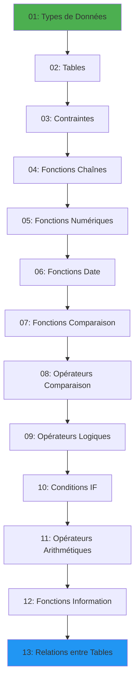

# 📚 SQL Course - Guide Complet

Un cours complet et structuré pour apprendre SQL (MySQL) de zéro à avancé, avec des exemples pratiques et des explications détaillées.

## 📋 Table des Matières

- [À Propos](#à-propos)
- [Prérequis](#prérequis)
- [Structure du Cours](#structure-du-cours)
- [Installation](#installation)
- [Utilisation](#utilisation)
- [Modules du Cours](#modules-du-cours)
- [Contribution](#contribution)
- [Licence](#licence)

## 🎯 À Propos

Ce cours SQL est conçu pour vous guider progressivement à travers tous les concepts essentiels de SQL et MySQL. Chaque module contient des explications claires, des exemples de code et des exercices pratiques.

### Objectifs d'Apprentissage

- ✅ Comprendre les types de données SQL
- ✅ Maîtriser la création et la gestion des tables
- ✅ Utiliser les contraintes pour garantir l'intégrité des données
- ✅ Manipuler les chaînes, nombres et dates avec les fonctions SQL
- ✅ Utiliser les opérateurs de comparaison et logiques
- ✅ Comprendre les relations entre tables et les jointures
- ✅ Écrire des requêtes SQL complexes et optimisées

## 🔧 Prérequis

Avant de commencer ce cours, vous devez avoir :

- **MySQL** installé sur votre machine (version 5.0.3 ou supérieure recommandée)
- Un éditeur SQL (MySQL Workbench, phpMyAdmin, ou tout autre client SQL)
- Des connaissances de base en informatique
- Aucune expérience préalable en SQL n'est requise !

## 📂 Structure du Cours

Le cours est organisé en 13 modules progressifs :

```
SQL-Course/
├── 01-data-types/              # Types de données (Numeric, Date, String)
├── 02-tables/                  # Création et gestion des tables
├── 03-constraint/              # Contraintes SQL
├── 04-string-functions/        # Fonctions de manipulation de chaînes
├── 05-numeric-functions/       # Fonctions numériques
├── 06-date-functions/          # Fonctions de date et heure
├── 07-comparison-functins/     # Fonctions de comparaison
├── 08-Comparison-Operators/    # Opérateurs de comparaison
├── 09-Logical-Operators/       # Opérateurs logiques
├── 10-if/                      # Conditions IF
├── 11-arithmetic-operators/    # Opérateurs arithmétiques
├── 12-information-functions/   # Fonctions d'information
└── 13-relationship-between-tables/  # Relations et jointures
```

## 🚀 Installation

### 1. Installer MySQL

**Windows :**
```bash
# Téléchargez MySQL depuis https://dev.mysql.com/downloads/installer/
# Suivez l'assistant d'installation
```

**macOS :**
```bash
brew install mysql
brew services start mysql
```

**Linux (Ubuntu/Debian) :**
```bash
sudo apt update
sudo apt install mysql-server
sudo systemctl start mysql
```

### 2. Cloner le Repository

```bash
git clone https://github.com/Mahmoud-Saadaoui/SQL-Course.git
cd SQL-Course
```

### 3. Vérifier l'Installation

```bash
mysql --version
```

## 💻 Utilisation

### Démarrer avec le Cours

1. **Commencez par le Module 01** - Types de données
2. **Lisez le README** de chaque module pour comprendre les concepts
3. **Pratiquez les exemples** fournis dans chaque section
4. **Progressez séquentiellement** à travers les modules

### Exemple d'Utilisation

```bash
# Ouvrez votre client MySQL
mysql -u root -p

# Créez une base de données de test
CREATE DATABASE sql_course;
USE sql_course;

# Suivez les exemples du cours
```

## 📖 Modules du Cours

### Module 01 : Types de Données
Apprenez les différents types de données MySQL :
- **Numériques** : TINYINT, SMALLINT, MEDIUMINT, INT, BIGINT
- **Date et Heure** : DATE, DATETIME, TIMESTAMP, TIME, YEAR
- **Chaînes** : CHAR, VARCHAR, TEXT, BLOB

[📁 Voir le module](./01-data-types)

---

### Module 02 : Tables
Maîtrisez la création et la gestion des tables :
- Création de bases de données
- Création et modification de tables
- Commandes ALTER, RENAME, DROP
- Gestion des colonnes et types

[📁 Voir le module](./02-tables)

---

### Module 03 : Contraintes
Garantissez l'intégrité des données avec les contraintes :
- PRIMARY KEY
- FOREIGN KEY
- UNIQUE
- NOT NULL
- DEFAULT

[📁 Voir le module](./03-constraint)

---

### Module 04 : Fonctions de Chaînes
Manipulez les chaînes de caractères :
- CONCAT, SUBSTRING, LENGTH
- UPPER, LOWER, TRIM
- REPLACE, REVERSE

[📁 Voir le module](./04-string-functions)

---

### Module 05 : Fonctions Numériques
Travaillez avec les nombres :
- ROUND, CEIL, FLOOR
- ABS, POWER, SQRT
- MIN, MAX, AVG, SUM

[📁 Voir le module](./05-numeric-functions)

---

### Module 06 : Fonctions de Date
Gérez les dates et heures :
- NOW, CURDATE, CURTIME
- DATE_FORMAT, DATE_ADD, DATE_SUB
- DATEDIFF, YEAR, MONTH, DAY

[📁 Voir le module](./06-date-functions)

---

### Module 07 : Fonctions de Comparaison
Comparez les valeurs :
- GREATEST, LEAST
- COALESCE, NULLIF
- CASE expressions

[📁 Voir le module](./07-comparison-functins)

---

### Module 08 : Opérateurs de Comparaison
Utilisez les opérateurs :
- =, !=, <, >, <=, >=
- BETWEEN, IN, LIKE
- IS NULL, IS NOT NULL

[📁 Voir le module](./08-Comparison-Operators)

---

### Module 09 : Opérateurs Logiques
Combinez les conditions :
- AND, OR, NOT
- XOR
- Priorité des opérateurs

[📁 Voir le module](./09-Logical-Operators)

---

### Module 10 : Conditions IF
Utilisez la logique conditionnelle :
- IF statements
- CASE WHEN
- Conditions imbriquées

[📁 Voir le module](./10-if)

---

### Module 11 : Opérateurs Arithmétiques
Effectuez des calculs :
- +, -, *, /, %
- DIV, MOD
- Opérations sur colonnes

[📁 Voir le module](./11-arithmetic-operators)

---

### Module 12 : Fonctions d'Information
Obtenez des informations système :
- DATABASE, USER, VERSION
- CONNECTION_ID
- Métadonnées

[📁 Voir le module](./12-information-functions)

---

### Module 13 : Relations entre Tables
Maîtrisez les relations et jointures :
- GROUP BY, ORDER BY, HAVING
- INNER JOIN, LEFT JOIN, RIGHT JOIN
- Relations One-to-Many, Many-to-Many
- Clés étrangères et intégrité référentielle

[📁 Voir le module](./13-relationship-between-tables)

---

## 🎓 Parcours d'Apprentissage Recommandé



## 🤝 Contribution

Les contributions sont les bienvenues ! Si vous souhaitez améliorer ce cours :

1. **Fork** le projet
2. Créez une **branche** pour votre fonctionnalité (`git checkout -b feature/AmazingFeature`)
3. **Committez** vos changements (`git commit -m 'Add some AmazingFeature'`)
4. **Push** vers la branche (`git push origin feature/AmazingFeature`)
5. Ouvrez une **Pull Request**

### Suggestions d'Amélioration

- Ajout d'exercices pratiques
- Traduction en d'autres langues
- Ajout de quiz et tests
- Exemples de projets réels
- Vidéos explicatives

## 📝 Licence

Ce projet est sous licence MIT. Voir le fichier `LICENSE` pour plus de détails.

## 📧 Contact

**Mahmoud Saadaoui**

- GitHub: [@Mahmoud-Saadaoui](https://github.com/Mahmoud-Saadaoui)
- Repository: [SQL-Course](https://github.com/Mahmoud-Saadaoui/SQL-Course)

## 🌟 Remerciements

Merci d'utiliser ce cours SQL ! N'hésitez pas à :
- ⭐ **Star** ce repository si vous le trouvez utile
- 🐛 **Signaler** les bugs ou erreurs
- 💡 **Suggérer** des améliorations
- 📢 **Partager** avec d'autres apprenants

---

<div align="center">
  <strong>Bon apprentissage ! 🚀</strong>
  <br>
  <em>De débutant à expert en SQL</em>
</div>
